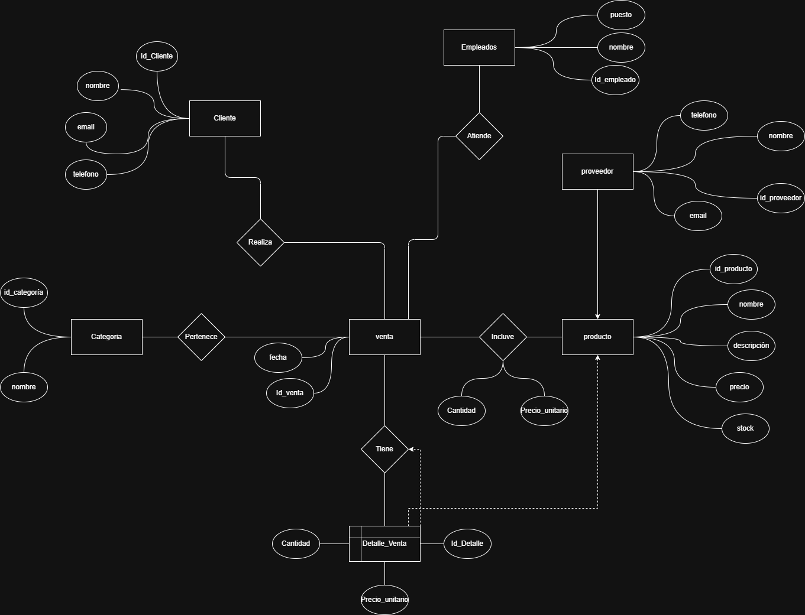
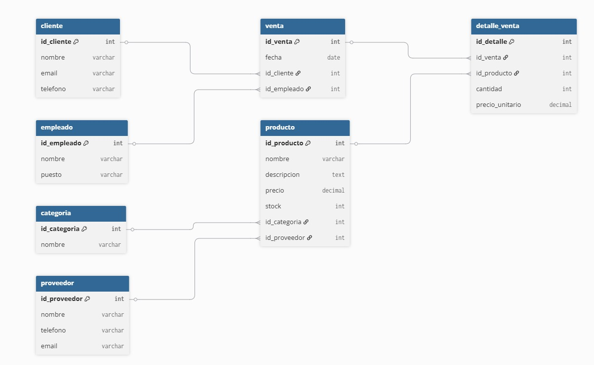

# ALIENTRONIC
### Sistema de Gestion de Inventario y Ventas
**CC3088 - Bases de Datos 1 | Ciclo 1, 2026 | Universidad del Valle de Guatemala**

---

## Stack tecnologico

| Capa | Tecnologia |
|------|------------|
| Base de datos | PostgreSQL 15 |
| Backend | Node.js + Express |
| Frontend | HTML / CSS / JavaScript puro |
| Infraestructura | Docker + Docker Compose |

---

## Diagramas del modelo de datos

### Diagrama Entidad-Relacion

El Diagrama Entidad-Relacion representa la estructura conceptual del sistema. En el modelo se identifican ocho entidades principales: `categoria`, `proveedor`, `producto`, `cliente`, `empleado`, `usuario`, `venta` y `detalle_venta`.

Las relaciones mas importantes del DER son las siguientes:

- Una `categoria` puede clasificar muchos `producto`, pero cada producto pertenece a una sola categoria.
- Un `proveedor` puede suministrar muchos `producto`, mientras que cada producto se registra con un proveedor principal.
- Un `cliente` puede realizar muchas `venta`, pero cada venta pertenece a un unico cliente.
- Un `empleado` puede registrar muchas `venta`, y cada venta queda asociada al empleado que la atendio.
- Un `empleado` tiene una relacion uno a uno con `usuario`, ya que cada cuenta del sistema corresponde a un empleado especifico.
- La relacion entre `venta` y `producto` es de muchos a muchos, por lo que se resuelve con la entidad asociativa `detalle_venta`, donde tambien se almacenan atributos propios de la transaccion como `cantidad` y `precio_unitario`.

Este diagrama permite entender la logica del negocio antes de pasar a la implementacion fisica en PostgreSQL, mostrando entidades, atributos y cardinalidades.



### Modelo relacional

El modelo relacional traduce el DER a tablas concretas dentro de la base de datos. Cada entidad conceptual se convierte en una tabla con su llave primaria, y las relaciones se implementan mediante llaves foraneas.

La implementacion relacional del proyecto queda organizada asi:

- `categoria(id_categoria)` y `proveedor(id_proveedor)` funcionan como tablas de apoyo para clasificar y abastecer productos.
- `producto(id_producto)` referencia a `categoria` y `proveedor` mediante `id_categoria` e `id_proveedor`.
- `cliente(id_cliente)` almacena la informacion basica de los compradores.
- `empleado(id_empleado)` registra al personal que participa en las ventas.
- `usuario(id_usuario)` enlaza credenciales de acceso con `empleado(id_empleado)`, reforzando la relacion uno a uno mediante una restriccion `UNIQUE`.
- `venta(id_venta)` conecta cada venta con un cliente y un empleado.
- `detalle_venta(id_detalle)` descompone cada venta en productos individuales y resuelve la relacion muchos a muchos entre `venta` y `producto`.

Ademas de las claves primarias y foraneas, el modelo incluye restricciones `NOT NULL`, `CHECK`, `UNIQUE` e indices para mantener integridad y mejorar el rendimiento de consultas frecuentes.



---

## Levantar el proyecto desde cero

### Requisitos previos

- [Docker Desktop](https://www.docker.com/products/docker-desktop/) instalado y corriendo
- Git

### Pasos

```bash
# 1. Clonar el repositorio
git clone <URL_DEL_REPOSITORIO>
cd alientronic

# 2. Crear el archivo .env (copiar desde el ejemplo)
cp .env.example .env

# 3. Levantar todos los servicios
docker compose up --build
```

En aproximadamente 30 segundos los servicios estaran listos:

| Servicio | URL |
|---------|-----|
| Frontend | http://localhost:8080 |
| Backend API | http://localhost:3000 |
| PostgreSQL | localhost:5432 |

### Credenciales de acceso

- **Usuario BD:** `proy2`
- **Contrasena BD:** `secret`
- **Login app:** `ana.garcia` / `password123`

Tambien disponibles: `pedro.hdz`, `laura.jimenez`, `marcos.ruiz` y `elena.vargas`, todos con contrasena `password123`.

---

## Estructura del proyecto

```text
alientronic/
|-- docker-compose.yml
|-- .env.example
|-- database/
|   `-- init.sql           <- DDL, indices, view y datos de prueba
|-- backend/
|   |-- Dockerfile
|   |-- package.json
|   |-- server.js          <- Entry point de Express
|   |-- db.js              <- Pool de conexion a PostgreSQL
|   |-- middleware/
|   |   `-- auth.js
|   `-- routes/
|       |-- auth.js
|       |-- productos.js
|       |-- clientes.js
|       |-- ventas.js
|       |-- reportes.js
|       `-- catalogos.js
|-- frontend/
|   |-- nginx.conf
|   |-- login.html
|   |-- css/style.css
|   |-- js/app.js
|   `-- pages/
|       |-- dashboard.html
|       |-- productos.html
|       |-- clientes.html
|       |-- ventas.html
|       `-- reportes.html
`-- docs/
    `-- diagramas/
        |-- der-proyecto2.png
        `-- modelo-relacional.jpeg
```

---

## Funcionalidades implementadas

### I. Diseno de base de datos

- Diagrama ER con entidades, atributos, relaciones y cardinalidades
- Modelo relacional documentado
- Normalizacion justificada hasta 3FN
- DDL completo con `PRIMARY KEY`, `FOREIGN KEY`, `NOT NULL` y `CHECK`
- Script de datos de prueba con 25 o mas registros por tabla principal
- Indices explicitos en columnas de uso frecuente

### II. SQL ejecutado desde la app web

- **3 consultas con JOIN multiple**
- `GET /api/reportes/ventas-resumen` - venta + cliente + empleado + detalle
- `GET /api/reportes/productos-detalle` - producto + categoria + proveedor
- `GET /api/reportes/top-productos` - producto + categoria + detalle_venta
- **2 consultas con subquery**
- `GET /api/reportes/clientes-laptops` - subquery con `IN`
- `GET /api/reportes/productos-sin-ventas` - subquery con `NOT EXISTS`
- `GET /api/reportes/empleados-ventas` - `GROUP BY`, `HAVING`, `AVG` y `SUM`
- `GET /api/reportes/ventas-mensuales` - CTE `WITH` + `RANK()`
- `vista_ventas_detalle` para alimentar la UI
- Transaccion explicita con `BEGIN`, `COMMIT` y `ROLLBACK` en `POST /api/ventas`

### III. Aplicacion web

- CRUD completo de productos y clientes
- Reporte de ventas visible en la interfaz
- Manejo de errores y validaciones en frontend y backend
- README con instrucciones funcionales y documentacion de diagramas

### IV. Funciones adicionales

- Autenticacion con login, logout y sesion usando `express-session`
- Exportacion de reportes a CSV desde la interfaz

---

## Normalizacion de la base de datos

La base de datos del sistema fue normalizada siguiendo las formas normales hasta FNBC, garantizando integridad, eliminacion de redundancias y consistencia en los datos.

### Primera Forma Normal (1FN)

Todas las tablas cumplen con los requisitos de 1FN:

| Tabla | Clave primaria | Atributos atomicos | Sin grupos repetitivos | Cumple |
|-------|----------------|--------------------|------------------------|--------|
| cliente | id_cliente | Si | Si | Si |
| empleado | id_empleado | Si | Si | Si |
| proveedor | id_proveedor | Si | Si | Si |
| categoria | id_categoria | Si | Si | Si |
| producto | id_producto | Si | Si | Si |
| venta | id_venta | Si | Si | Si |
| detalle_venta | id_detalle | Si | Si | Si |

Todas las columnas contienen valores atomicos y no existen atributos multivaluados ni estructuras repetitivas.

### Segunda Forma Normal (2FN)

Se verifica que no existen dependencias parciales:

| Tabla | Clave primaria | Dependencias parciales | Descripcion | Cumple |
|-------|----------------|------------------------|-------------|--------|
| venta | id_venta | No | Todos los atributos dependen de la PK | Si |
| detalle_venta | id_detalle | No | Dependencia completa de la clave primaria | Si |

La tabla `detalle_venta` utiliza una clave primaria artificial (`id_detalle`), lo que garantiza que todos los atributos dependan completamente de la clave.

### Tercera Forma Normal (3FN)

Se evaluan posibles dependencias transitivas:

| Tabla | Dependencia transitiva | Atributo | Justificacion | Cumple |
|-------|------------------------|----------|---------------|--------|
| detalle_venta | Posible | precio_unitario | Se guarda como historico de la venta | Si |

Aunque `precio_unitario` podria derivarse de `producto.precio`, se almacena para conservar el valor al momento de la transaccion, lo cual es una practica estandar en sistemas de ventas.

### Forma Normal de Boyce-Codd (FNBC)

Se valida que todos los determinantes sean superllaves:

| Tabla | Determinante | Es superllave | Cumple |
|-------|--------------|---------------|--------|
| cliente | id_cliente | Si | Si |
| empleado | id_empleado | Si | Si |
| producto | id_producto | Si | Si |
| venta | id_venta | Si | Si |
| detalle_venta | id_detalle | Si | Si |

En las tablas principales, cada dependencia funcional tiene como determinante una clave candidata o superllave. Por ello, el esquema se considera consistente hasta FNBC dentro del alcance del proyecto.

---

## API endpoints

### Auth

| Metodo | Ruta | Descripcion |
|--------|------|-------------|
| POST | `/api/auth/login` | Iniciar sesion |
| POST | `/api/auth/logout` | Cerrar sesion |
| GET | `/api/auth/me` | Verificar sesion activa |

### Productos

| Metodo | Ruta | Descripcion |
|--------|------|-------------|
| GET | `/api/productos` | Listar todos con JOIN |
| GET | `/api/productos/:id` | Obtener uno |
| POST | `/api/productos` | Crear |
| PUT | `/api/productos/:id` | Actualizar |
| DELETE | `/api/productos/:id` | Eliminar |

### Clientes

| Metodo | Ruta | Descripcion |
|--------|------|-------------|
| GET | `/api/clientes` | Listar todos |
| GET | `/api/clientes/:id` | Obtener uno |
| POST | `/api/clientes` | Crear |
| PUT | `/api/clientes/:id` | Actualizar |
| DELETE | `/api/clientes/:id` | Eliminar |

### Ventas

| Metodo | Ruta | Descripcion |
|--------|------|-------------|
| GET | `/api/ventas` | Listar todas usando la view |
| GET | `/api/ventas/:id` | Ver detalle completo |
| POST | `/api/ventas` | Registrar venta con transaccion |

### Reportes

| Metodo | Ruta | SQL utilizado |
|--------|------|---------------|
| GET | `/api/reportes/ventas-resumen` | JOIN de 4 tablas |
| GET | `/api/reportes/productos-detalle` | JOIN de 3 tablas |
| GET | `/api/reportes/top-productos` | JOIN + GROUP BY |
| GET | `/api/reportes/empleados-ventas` | GROUP BY + HAVING |
| GET | `/api/reportes/clientes-laptops` | Subquery con `IN` |
| GET | `/api/reportes/productos-sin-ventas` | Subquery con `NOT EXISTS` |
| GET | `/api/reportes/ventas-mensuales` | CTE `WITH` + window function |
| GET | `/api/reportes/exportar-ventas-csv` | Exportacion CSV |

---

## Detener el proyecto

```bash
docker compose down
```

Para eliminar tambien los datos persistidos:

```bash
docker compose down -v
```
